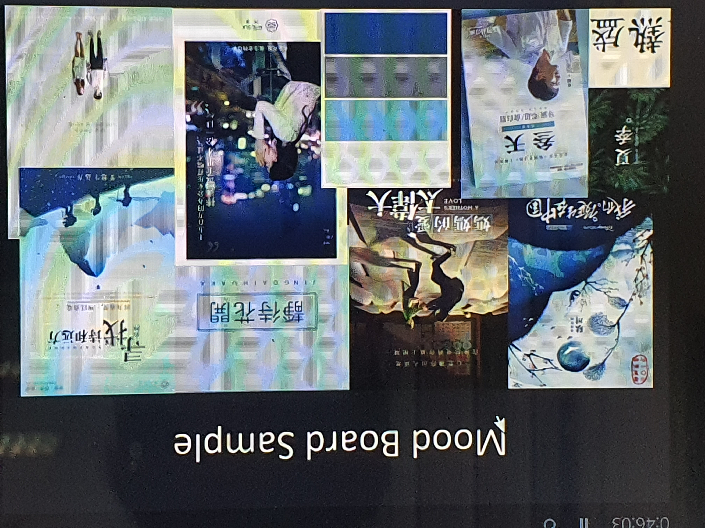

# Film Academy - Art and Design

***Week 2*** - *Monday(2/3/2020)*

## Film Poster Design

- Film posters are used to engage audience interest through a high ratio of **Photography and Text**

## Preparation

1. **Define your Film Genre & Audience**
    - At poster sessions there is intense competition for audience attention. In their first **3 seconds** your audience will determine whether to stay and exlpore your content or leave. If they stay you have **30 seconds** to secure their attention by converying an overall understanding of your subject matter.

2. **Create your Mood Board**
   - Add the poster sample you want to create, the colours you want to use and the styles you wish to include. There is one rule - 'only add what you truly love'.
   - To give overall design ideas and feel.
   - Include Colors, Fonts, Vectors

### **Curve-based Design System**

Curve templates give you a head start, the curves show the outline of the key imagery; the rectangles the position of the key text.

## **Step 1** - Striking Central Image(need image)

- A picture is worth a thousand words. Your design doesn't need a lot of text to say something.
- Your focus item should be enlarged so that it will occupy *at least 30% of the area of the finished poster.*
- Remember that your audience will not approach you if it s not clear what your topic or theme is from a "safe distance" of *10 feet (3 meters)*.

Reference: <http://www.impawards.com/> (Internet Movie Posters)

## **Step 2** - Creative use of Colour

- Your design's color scheme is probably the first thing your audience will notice about your poster(espeacially from afar), so it's important to get it right.

### Color Wheels(need image)

1. Color Pairing - **Complementary**
  
2. Color Pairing - **Analogous**
  
3. Color Pairing - **Triad**

4. Color Pairing - **Square (or tetrad)**

_Tools for pairing Colors - **Paletton**_

**60-30-10 Color Rule**

- Primary color - 60%
- Secondary color - 30%/10%

## **Step 3** - Size and style of font or tagline

### Typography(need image)

- **Serif & Sans Serif**
  - For example, if your poster content has something to do with a ***modern*** theme or concept, consider sticking with a clean **sans serif** typeface.
  - If you have a more serious poster design in mind or want to communicate class or a sense of whimsy, a **serif** typeface should do the trick.
- **Decorative Typefaces**
  - Fun and cute
  - One thing to remember with typefaces, avoid combining more than two different typefaces or four type variations (i.e. type size, bold or italic style)
  - When in doubt, stick to a sans serif font and serif font combination, or a decorative font for your poster headline and sans serif fonts for all other text.
  - However, **less is more** when it comes to posters.
  - The more information your poster has, the higher the risk that it will confuse and overwhelm the reader.

## Homework

1. Recreate a poster for your favourite movie. (3 weeks - *23/3/2020*)

## References for Fonts/Design/Ideas

- http://www.impawards.com/
- http://www.pinterest.com/
- http://www.behance.net/
- http://www.colorcombos.com/
- http://www.befonts.com/
- https://www.dafont.com/
- http://www.sj00.com/
- http://www.itmop.com/
- http://www.chinesefontdesign.com/
- http://www.unsplash.com/